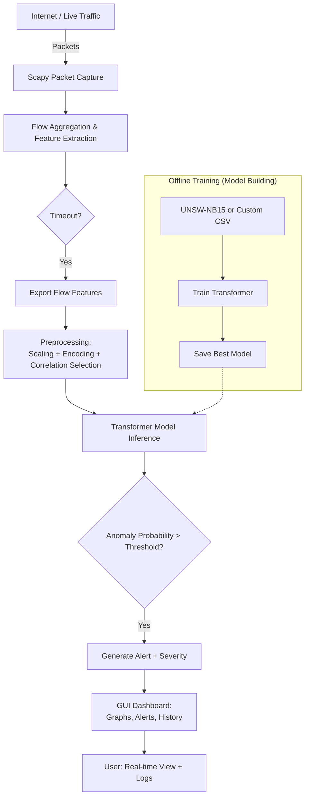

# Network Intrusion Detection System 🛡️🔥

**Real-time Hybrid NIDS** using Scapy packet capture, flow-based feature extraction, and **Transformer** deep learning for accurate anomaly & attack detection.


[](https://www.python.org/)
[](https://opensource.org/licenses/MIT)
[](https://github.com/YOUR_USERNAME/Network-Intrusion-Detection-system/stargazers)
[](https://github.com/YOUR_USERNAME/Network-Intrusion-Detection-system/network/members)
[](https://github.com/YOUR_USERNAME/Network-Intrusion-Detection-system/issues)
[](https://github.com/YOUR_USERNAME/Network-Intrusion-Detection-system/commits)

> [!IMPORTANT]  
> Admin/sudo privileges required for live packet capture (Scapy limitation).  
> NVIDIA GPU highly recommended for model training.

## ✨ Features

- 🚀 Real-time packet sniffing & flow construction with Scapy
- 📊 Deep protocol analysis (TCP/UDP/ICMP + more)
- 🧠 Transformer-based classifier for high-accuracy anomaly & multi-class attack detection
- ⚡ Smart preprocessing: normalization, encoding, correlation-based feature selection
- 📈 Modern GUI dashboard: live traffic stats, attack breakdown, alert timeline
- 🔔 Adaptive probability thresholding for alerts (low → critical severity)
- 🛠️ Modular & extensible — swap datasets, tune thresholds, experiment with models

## 🚀 Quick Start

```bash
# Clone the repo
git clone https://github.com/YOUR_USERNAME/Network-Intrusion-Detection-system.git
cd Network-Intrusion-Detection-system

# Setup virtual environment
python -m venv venv
source venv/bin/activate          # Windows → venv\Scripts\activate

# Install dependencies
pip install -r requirements.txt

# Launch (uses pre-trained model by default)
python main.py
```

GUI opens → choose interface → Start Monitoring → see threats live!
[!TIP]
Retrain on your own data?
```bash
python main.py --retrain
```
## 🏗️ System Architecture



## ⚙️ Installation
Prerequisites

Python 3.12+
Admin rights (packet capture)
Optional: CUDA-enabled GPU for training

```bash
git clone https://github.com/YOUR_USERNAME/Network-Intrusion-Detection-system.git
cd Network-Intrusion-Detection-system
python -m venv venv
source venv/bin/activate
pip install -r requirements.txt
```
## 📊 Dataset
Built around the UNSW-NB15 dataset — realistic modern network flows with 9 attack classes + normal traffic.

  UNSW-NB15 Feature Importance
  
Example: Feature importance visualization (common in UNSW-NB15 studies)

Custom data support
Place your CSV in data/ folder. Minimum required columns:

```csv
dur,proto,service,state,spkts,dpkts,sbytes,dbytes,rate,sload,dload,label
```
## 🧠 Training the Model

```bash
Full retrain (GPU recommended!)
python main.py --retrain

# Normal run → uses saved model
python main.py
```

Sample training output:
```text
[2026-02-01] Starting Transformer training...
Epoch 1/10 - loss: 0.685 → acc: 0.74
Epoch 2/10 - loss: 0.421 → acc: 0.89
...
Model saved → ready for inference!
```

## 📈 Real-Time Monitoring

- Run the app → GUI launches
- Select network interface (e.g. eth0, wlan0)
- Click Start
# Monitor:
- Live packets/sec & flow rate graphs
- Attack type distribution (pie/bar)
- Rolling alert feed with severity coloring
- History & export logs


## 🤝 Contributing
Contributions welcome — security tools need community!

- Fork the repo
- Create feature branch (git checkout -b feature/better-alerts)
- Commit your changes
- Push & open a Pull Request

-- Even small fixes (docs, bugs, new datasets) are appreciated!
## 📄 License
-- MIT © Midhun (mid_works) 2026

-- ⭐ Star if this project helps your cybersecurity journey!
text
